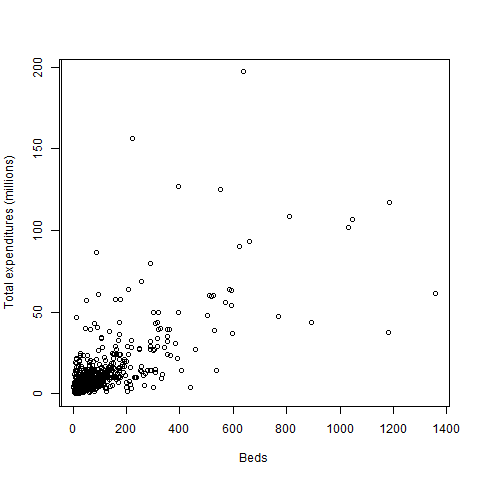

```{r, include = FALSE}
knitr::opts_chunk$set(
  collapse = TRUE,
  comment = "#>"
)
```
<script type="text/x-mathjax-config">
MathJax.Hub.Config({
  TeX: { equationNumbers: { autoNumber: "AMS" } }
});
</script>


A basic issue in sample design is how many units should be selected at each stage in order to efficiently estimate population values. If strata are used, the number of units to allocate to each stratum must be determined. In this vignette, we review some basic techniques for sample size determination in single-stage samples using the package `PracTools` [@Valliant.2023] that contains specialized routines to facilitate the calculations, most of which are not found in other packages. We briefly summarize some of selection methods and associated formulas used in designing single-stage samples and describe the capabilities of `PracTools`.  Technical background is in @VDK.2018, ch. 3. First, the package must be loaded with 
```{r setup}
library(PracTools)
```
Alternatively, `require(PracTools)` can be used.

Complex samples can involve any or all of stratification, clustering, multistage sampling, and sampling with varying probabilities. Many texts cover these topics, including @Cochran.1977, @Lohr.1999, @SSW.1992, and @VDK.2018. Here we discuss single-stage designs with and without stratification and formulas that are needed for determining sample allocations. The `PracTools` package will not select samples, but the R `sampling` package [@Tille.2016] will select almost all the types used in practice.

## Simple Random Sampling

Simple random sampling without replacement (*srswor*) is a method of probability sampling in which all samples of a given size $n$ have the same probability of selection. The function `sample` in R base [@Rcore] will select simple random samples either with or without replacement. One way of determining an *srswor* sample size is to specify that a population value $\small \theta$ be estimated with a certain coefficient of variation (*CV*) which is defined as the ratio of the standard error of the estimator, $\small \hat{\theta}$, to the value of the parameter:  $\small CV(\hat{\theta}) = \sqrt{Var(\hat{\theta})}/\theta$. For example, suppose that $\small y_{k}$ is a value associated with element $\small k$, $\small U$ denotes the set of all elements in the universe, $\small N$ is the number of elements in the population, and the population parameter to be estimated is the mean, $\small \bar{y}_{U} = \sum_{k \in U}y_{k}/N$. With a simple random sample, this can be estimated by the sample mean, $\small \bar{y}_{s} = \sum_{k \in s}y_{k}/n$, where $\small s$ is the set of sample elements and $\small n$ is the sample size. Setting the required $\small CV$ of $\small \bar{y}_{s}$ to some desired value $\small CV_{0}$ in an *srswor* leads to a sample size of
$$\small n=\frac{\frac{S_U^{2}}{\bar{y}_{U}^{2}}}{CV_{0}^{2} +\frac{S_U^{2}}{N\bar{y}_{U}^{2}}}$$

The R function, `nCont`, will compute a sample size using either a target $\small CV_{0}$ or a target variance, $\small V_{0}$, of $\small \bar{y}_s$ as input.  The parameters used by the function are shown below and are described in the help page for the function:
```
    nCont(CV0=NULL, V0=NULL, S2=NULL, ybarU=NULL, N=Inf, CVpop=NULL)
```

* **Example 1: Sample size for a target CV.**
Suppose that we estimate from a previous survey that the population CV of some variable is 2.0. If the population is extremely large and `CV0` (the target CV ) is set to 0.05, then the call
to the R function is `nCont(CV0 = 0.05, CVpop = 2)`. The resulting sample size is 1,600. If the population size is *N* = 500, then `nCont(CV0 = 0.05,CVpop = 2, N = 500)` results in a sample size of 381 after rounding. The finite population correction (*fpc*) factor has a substantial effect in the latter case.

The function `nProp` will perform the same computation for estimated proportions.

* **Example 2: Sample sizes for a vector of target CVs.**
Often it will be useful to show a client the sample sizes for a series of precision targets. This will be especially true when the budget is uncertain and a researcher would like to think about options. We can ask for the sample sizes for a vector of values of `CV0` from 0.01 to 0.21 in increments of 0.02 with:
```
    ceiling(nCont(CV0 = seq(0.01, 0.21, 0.02), CVpop=2))
    [1] 40000  4445  1600   817   494   331   237   178   139   111    91
```
`ncont` returns unrounded sample sizes having quite a few decimal places; `ceiling` rounds to the next highest integer.

### Using a margin of error to find sample sizes
Many investigators prefer to think of setting a tolerance for how close the estimate should be to the population value.  If the tolerance, sometimes called the *margin of error* (MOE), is $\small e$ and the goal is to be within  $\small e$ of the population mean with probability $\small 1-\alpha$, this translates to
\begin{equation}
\small Pr \left(\left|\bar{y}_{s} -\bar{y}_{U} \right|\le e\right)=1-\alpha.
\end{equation}
This is equivalent to setting the half-width of a $\small 100\left(1-\alpha \right)$ two-sided confidence interval (CI) to $\small e=z_{1-\alpha\left/2\right.} \sqrt{V\left(\bar{y}_{s} \right)}$, assuming that $\small \bar{y}_{s}$ can be treated as being normally distributed.  The term $\small z_{1-\alpha\left/2\right.}$ is the $\small 100\left(1-\alpha\left/2\right. \right)$ percentile of the standard normal distribution, i.e., the point with $\small 1-\alpha\left/2\right.$ of the area to its left.  On the other hand, if we require
\begin{equation}
   \small Pr \left(\left|\frac{\bar{y}_{s} -\bar{y}_{U}}{\bar{y}_{U}} \right|\le e\right)=1-\alpha, \end{equation}

this corresponds to setting $\small e=z_{1-\alpha\left/2\right. }CV\left(\bar{y}_{s}\right)$.   If we set the MOE in (1) to $\small e_{0}$, then the above equation can be manipulated to give the required sample size as

\begin{equation}
  \small n=\frac{z_{1-\alpha\left/2\right.}^{2} S_U^{2}}{e_{0}^{2}+z_{1-\alpha\left/2\right.}^{2} S_U^{2}\left/N\right.}.
\end{equation}

Similarly, if the MOE in (2) is set to $\small e_{0}$, we obtain
\begin{equation}
   \small n=\frac{z_{1-\alpha\left/2\right.}^{2} S_U^{2}\left/ \bar{y}_{U}^{2}\right.}{e_{0}^{2} +z_{1-\alpha \left/2\right.}^{2} S_U^{2}\left/ \left(N\bar{y}_{U}^{2} \right)\right.}
\end{equation}
The functions `nContMoe` and `nPropMoe` will make the sample size calculations based on MOEs for continuous variables and for proportions. 

* **Example 3: Sample sizes  for proportions based on an MOE.** 
Suppose that we want to estimate a proportion for a characteristic where an advance estimate is $\small p_{U} =0.5$. The MOE is to be $\small e$ when $\small \alpha =0.05$.  In other words, the sample should be large enough that a normal-approximation 95\% confidence interval should be $\small 0.50\pm e$ as implied by (1).  For example, if $\small e=0.03$ and the estimated proportion were actually 0.5, we want the confidence interval to be $\small 0.50\pm 0.03=\left[0.47,0.53\right]$.  The sample size is highly dependent on the width of the confidence interval as seen in the following table.  Sample sizes are evaluated using the formula given in (3) with $\small S_U^2 = Np_U(1-p_U)/(N-1)$, $\small p_{U} =0.5$ and $\small z_{0.975} =1.96$. The command to generate the sample sizes listed in the table below is

```{r}
    ceiling(nPropMoe(moe.sw=1, e=seq(0.01,0.08,0.01), alpha=0.05, pU=0.5))
```
| $e$  | $n$  |   | $e$  | $n$ |
|-----:|-----:|--:|-----:|----:|
| 0.01 | 9,604 |   |0.05  | 385 |
| 0.02 | 2,401 |   | 0.06 | 267 |
| 0.03 | 1,068 |   | 0.07 | 196 |
| 0.04 | 601   |   | 0.08 | 151 |

The parameter `moe.sw=1` says to compute the sample size based on (3). `moe.sw=2` would use the MOE relative to $\small \bar{y}_U$ in (4).


## Stratified Simple Random Sampling

Simple random samples are rare in practice for several reasons.  Most surveys have multiple variables and domains for which estimates are desired.  Selecting a simple random sample runs the risk that one or more important domains will be poorly represented or omitted entirely.  In addition, variances of survey estimates often can be reduced by using a design that is not *srswor*.

A design that remedies some of the problems noted for an *srswor* is referred to as stratified simple random sampling (without replacement) or *stsrswor*.  As the name indicates, an *srswor* design is administered within each design stratum.  Strata are defined with one or more variables known for *all* units and partition the entire population into mutually exclusive groups of units.  We might, for example, divide a population of business establishments into retail trade, wholesale trade, services, manufacturing, and other sectors.  A household population could be divided into geographic regions---north, south, east, and west.  For an *stsrswor*, we define the following terms:

$\small N_{h}$ = the known number of units in the population in stratum *h* ($\small h=1,2,\ldots ,H$)

$\small n_{h}$  = the size of the *srswor* selected in stratum *h*

$\small y_{hi}$  = the value of the *y* variable for unit *i* in stratum *h*

$\small S_{Uh}^{2}=\sum_{i=1}^{N_{h}}\left(y_{hi}-\bar{y}_{U_h}\right)^{2}\left/ \left(N_{h} -1\right)\right.$, the population variance in stratum *h*
    
$\small U_{h}$ = set of all units in the population from stratum *h*

$\small s_{h}$  = set of $\small n_{h}$ sample units from stratum *h*

$\small c_h$ = cost per sample unit in stratum *h*

 The population mean of *y* is $\small \bar{y}_{U} =\sum_{h=1}^{H}W_{h}\bar{y}_{U_h}$,
where $\small W_{h}=N_{h}\left/ N\right.$ and $\small \bar{y}_{U_h}$ is the population mean in stratum *h*.  The sample estimator of $\small \bar{y}_{U}$ based on an *stsrswor* is
\begin{equation} 
   \small \bar{y}_{st} =\sum_{h=1}^{H}W_{h} \bar{y}_{s_h}, \notag
\end{equation}
where $\small \bar{y}_{s_h} =\sum_{i\in s_{h}}y_{hi}\left/n_{h}\right.$.  The population sampling variance of the stratified estimator of the mean is
\begin{equation} 
\small Var\left(\bar{y}_{st}\right) = \sum_{h=1}^{H}W_{h}^{2} \frac{1-f_{h}}{n_{h}} S_{Uh}^{2}, \notag
\end{equation}
where $\small f_{h} = n_{h}\left/N_{h}\right.$.  The total cost of the sample is
$$\small C = \sum_{h=1}^{H} c_h n_h.$$

There are various ways of allocating the sample to the strata, including:

1. Proportional to the $\small N_h$ population counts 

2. Equal allocation (all $\small n_h$ the same)

3. Cost-constrained optimal in which the allocation minimizes the variance of $\small \bar{y}_{st}$ subject to a fixed budget

4. Variance-constrained optimal in which the allocation minimizes the total cost subject to a fixed variance target for $\small \bar{y}_{st}$

5. Neyman allocation, which minimizes the variance of the estimated mean disregarding the $\small c_h$ costs

The R function, `strAlloc`, will compute the proportional, Neyman, cost-constrained, and variance-constrained allocations. The parameters accepted by the function are shown below.

```
   n.tot = fixed total sample size 
   Nh = vector of pop stratum sizes or pop stratum proportions (required parameter)
   Sh = stratum unit standard deviations, required unless alloc = "prop" 
   cost = total variable cost 
   ch = vector of costs per unit in strata
   V0 = fixed variance target for estimated mean 
   CV0 = fixed CV target for estimated mean 
   ybarU = pop mean of y  
   alloc = type of allocation, must be one of "prop", "neyman", "totcost", "totvar"
```

If the stratum standard deviations are unknown (as would usually be the case), estimates can be used.

The parameters can only be used in certain combinations, which are checked at the beginning of the function. Basically, given an allocation, only the parameters required for the allocation are allowed and no more. For example, the Neyman allocation requires `Nh`, `Sh`, and `n.tot`. The function returns a list with three components---the allocation type, the vector of sample sizes, and the vector of sample proportions allocated to each stratum.  Three examples of allocations are Neyman, cost constrained, and variance constrained (via a target CV):
```{r}
# Neyman allocation
Nh <- c(215, 65, 252, 50, 149, 144)
Sh <- c(26787207, 10645109, 6909676, 11085034, 9817762, 44553355)
strAlloc(n.tot = 100, Nh = Nh, Sh = Sh, alloc = "neyman")

# cost constrained allocation
ch <- c(1400, 200, 300, 600, 450, 1000)
strAlloc(Nh = Nh, Sh = Sh, cost = 100000, ch = ch, alloc = "totcost")

# allocation with CV target of 0.05
strAlloc(Nh = Nh, Sh = Sh, CV0 = 0.05, ch = ch, ybarU = 11664181, alloc = "totvar")
```
The output of `strAlloc` is a list with components: `allocation` (the type of allocation), `Nh`, `Sh`, `nh`, `nh/n`, and `anticipated SE of estimated mean`. If the results are assigned to an object, e.g.,
```neyman <- strAlloc(n.tot = 100, Nh = Nh, Sh = Sh, alloc = "neyman")```,
the components in the list can be accessed with syntax like `neyman$nh`.

There are many variations on how to allocate a sample to strata. In most practical applications, there are multiple variables for which estimates are needed. This complicates the allocation problem because each variable may have a different optimal allocation. This type of multicriteria problem can be solved using mathematical programming as discussed in @VDK.2018, ch. 5. 

## Probability Proportional to Size Sampling

Probability proportional to size (*pps*), single-stage sampling is used in situations where an auxiliary variable (i.e., a covariate) is available on the frame that is related to the variable(s) to be collected in a survey. For example, the number of employees in a business establishment one year ago is probably related to the number of employees the establishment has in the current time period. 

The variance formula for an estimated mean in a *pps* sample selected without replacement is too complex to be useful in determining a sample size. Thus, a standard workaround is to use the with-replacement (*ppswr*) variance formula to calculate a sample size. The result may be somewhat larger than needed to hit a precision target, but if the sample is reduced by nonresponse, beginning with a larger sample is prudent anyway. The simplest estimator of the mean that is usually studied with *ppswr* sampling is called ``*p*-expanded with replacement'' or *pwr* (see @SSW.1992, ch.2) and is defined as
\begin{equation}
   \small \hat{\bar{y}}_{\textit{pwr}} =\frac{1}{Nn} \sum_{i \in s}\frac{y_{i}}{p_{i}} \notag
\end{equation}
where $\small p_i$ is the probability that unit $\small i$ would be selected in a sample of size 1. The variance of $\small \hat{\bar{y}}_{\textit{pwr}}$ in *ppswr* sampling is
\begin{equation} \label{eq:vpwr}
    \small Var\left(\hat{\bar{y}}_{pwr} \right)=\frac{1}{N^{2} n} \sum_{U}p_{i} \left(\frac{y_{i}}{p_{i}} - t_U\right)^{2}  \equiv \frac{V_{1}}{N^{2}n}
\end{equation}
where $\small t_U$ is the population total of $\small y$.  

If the desired coefficient of variation is $\small CV_{0}$, $\small \eqref{eq:vpwr}$ can be solved to give the sample size as
\begin{equation} \label{eq:n.pwr}
    \small n=\frac{V_{1}}{N^{2}} \frac{1}{\bar{y}_{U}^{2} CV_{0}^{2}}\;.
\end{equation}




* **Example 4: Sample size in a *pps* sample.** 
We use `smho.N874`, which is one of the example populations in the `PracTools` package, to illustrate a *pps* sample size calculation. Figure 1 plots annual expenditures per hospital versus number of beds for the 670 hospitals that have inpatient beds. Although the relationship is fairly diffuse, the correlation of beds and expenditures is 0.70 so that *pps* sampling with beds as a measure of size could be efficient. The code below evaluates $\small \eqref{eq:n.pwr}$ giving a *pps* sample of $\small n = 57$, which will produce an anticipated *CV* of 0.149. In contrast, an *srs* of $\small n = 82$ would be necessary to obtain the same size *CV*.
```{r}
require(PracTools)
data("smho.N874")

y <- smho.N874[,"EXPTOTAL"]
x <- smho.N874[, "BEDS"]
y <- y[x>0]
x <- x[x>0]
ybarU <- mean(y)

(N <- length(x))
CV0 <- 0.15

  # calculate V1 based on pp(x) sample
pik <- x/sum(x)
T <- sum(y)
(V1 <- sum( pik*(y/pik - T)^2))

n <- V1 / (N*ybarU*CV0)^2
(n <- ceiling(n))

  # Anticipated SE for the pps sample
(cv.pps <- sqrt(V1/(N^2*n)) / ybarU)

  # sample size for an srs to produce the same SE
ceiling(nCont(CV0 = cv.pps, S2 = var(y), ybarU = ybarU, N = N))

```

The `PracTools` package includes a variety of other functions relevant to the design of single-stage samples that are not discussed in this vignette:

| Function | Description |
|:----------|:------------|
|||
| `gammaFit` | Iteratively computes estimate of $\small \gamma$ in a model with $\small E_M(y) = \mathbf{x}^T\boldsymbol{\beta}$ and $\small \sigma^2 \mathbf{x}^\gamma$. This is useful in determining a measure of size for *pps* sampling.  | 
| `nDep2sam` | Compute a simple random sample size for estimating the difference in means when samples overlap  |
| `nDomain`  | Compute a simple random sample size using either a target coefficient of variation or target variance for an estimated mean or total for a domain |
| `nLogOdds` | Calculate the simple random sample size for estimating a proportion using the log-odds transformation |
| `nProp`    | Compute the simple random sample size for estimating a proportion based on different precision requirements |
| `nProp2sam`| Compute a simple random sample size for estimating the difference in proportions when samples overlap |
| `nWilson`  | Calculate a simple random sample size for estimating a proportion using the Wilson method | 


## References
